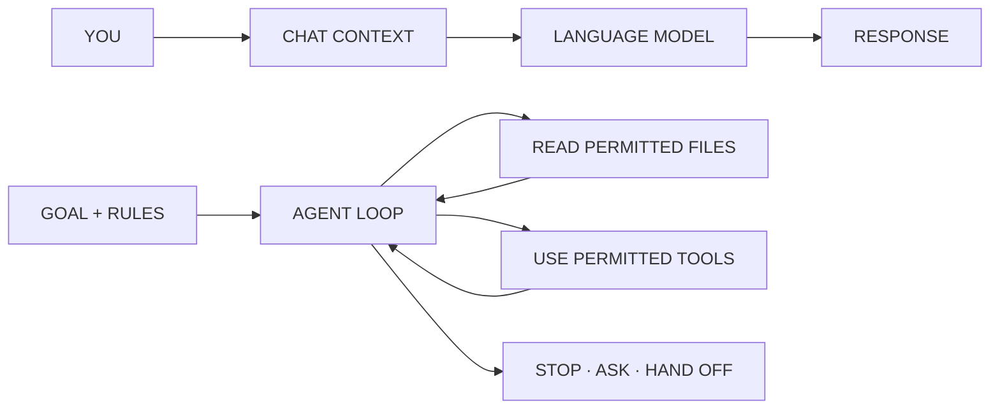

# Lab · Create Your Course Agent

By noon, every student should have a working course agent that can read enabled course material, cite the repository, create work only inside a private workspace, and prepare a commit for human approval.

This agent will stay with you for the course. It will help organize evidence, test ideas, and prepare artifacts. It does not replace your judgment and cannot submit work for you.

## What we are using

- **OpenCode:** the agent interface and tool loop
- **OpenRouter:** the model provider
- **DeepSeek V4 Flash:** `openrouter/deepseek/deepseek-v4-flash`
- **Student materials repository:** released course reference, read-only
- **Private workspace repository:** your work, bounded by local permissions and repository checks

Complete the [setup guide](../../setup/setup-guide.md) before class. Installation and account recovery are fallback work, not the main lab.

## Chatbot and agent

A chatbot sends conversation context to a model and returns a response.

An agent can also inspect files, choose a next step, use permitted tools, observe the result, and continue until it reaches a stopping condition or asks a person.



We are using both: conversation is the interface, while OpenCode supplies the file and Git tool loop.

## Context is the working packet

The model does not automatically read the whole repository. Its current context is assembled from:

- system and agent instructions;
- the conversation;
- files the agent reads;
- tool results;
- outputs it produced earlier that still fit in the context window.

The model's trained weights are not the course repository. The repository becomes useful only when the agent reads the relevant files and keeps their content in the current working context.

Ask the agent to cite paths. A confident answer without a course path is not proof that it used the course material.

## 1 · Verify the two repositories

Your folders should be siblings:

```text
courses/
  applied-generative-ai-course-students/
  applied-generative-ai-work/
```

Pull the materials repository, then start OpenCode from the private workspace.

## 2 · Verify the model and permissions

Inside OpenCode:

1. Confirm the selected agent is `course-agent`.
2. Confirm the model is `openrouter/deepseek/deepseek-v4-flash`.
3. Ask: “Which paths may you edit, and which course path is read-only? Cite the instruction file.”

Reject any request to read a credential or write into the student-materials repository.

## 3 · Give the agent a small working profile

Create `session-work/agent-profile.md` with the agent. Include only:

- the name or handle you want it to use;
- two learning goals for this course;
- one business domain or public problem you care about;
- whether you prefer a short answer, a worked example, or questions first;
- actions that always require your confirmation.

Do not include grades, student IDs, accommodations, private feedback, or information about another student.

The agent should read this profile at the beginning of later course work. You can revise it at any time.

## 4 · Run the course check

Type:

```text
/course-check
```

The agent must answer three questions using the released repository:

1. What is due next?
2. Where should the artifact be saved?
3. What privacy or evidence rule applies?

It then creates exactly:

```text
session-work/session-01/agent-check.md
```

The file must contain repository path citations, the exact model ID, one unresolved question, and the next action.

## 5 · Inspect the boundary

Before committing, inspect:

```text
git diff --name-only
git diff
```

Pass conditions:

- every changed path is under `session-work/`;
- the answer cites current course files;
- no key or private student information appears;
- the agent names an uncertainty rather than inventing an answer;
- no course reference file changed.

If another path changed, stop. Do not “fix it later.” Revert the unintended edit with the instructor's help and identify why the boundary failed.

## 6 · Prepare one bounded commit

Create a non-default branch if you do not already have one:

```text
git switch -c student/session-01-agent-check
```

After reviewing the file and diff, allow the agent to run:

```text
node scripts/commit-work.mjs "Add Session 1 agent check"
```

The wrapper rejects changes outside the workspace paths and scans for common credential patterns. It creates a local commit but does not push.

Review:

```text
git show --stat
```

Only then approve a push. Repository checks and instructor review are the enforcement boundary; the agent prompt alone is not security.

## Functional exercise

Give the agent this sample observation:

> At 11:42 AM, two people stopped at the same lobby sign, looked between two arrows, and walked in opposite directions. The sign contains four destinations and two arrows. We did not ask either person what they intended to find.

Ask it to produce:

1. direct observations;
2. interpretations that need evidence;
3. unknowns;
4. one bounded generative-AI role;
5. one condition requiring human review.

The agent passes if it does not turn “people looked at a sign” into “the sign is confusing everyone.” It should preserve the difference between evidence and hypothesis.

## When something breaks

| Symptom | Next action |
|---|---|
| The agent cannot cite course files | Confirm the sibling folder name and ask it to read the exact Session 1 guide. |
| It writes into course materials | Reject the action, save the permission message, and notify the instructor. |
| It claims something is due without a path | Ask it to locate the assignment brief and quote the heading, not the entire document. |
| It changes several files | Stop and reduce the request to one file. Inspect every diff. |
| The model repeatedly ignores tool requests | Preserve the failure and use the instructor's verified fallback model or paired workstation. |
| OpenRouter returns `401` or `402` | Reconnect the key or check its capped balance. |
| A secret appears in a file | Remove it, revoke the credential, and create a replacement before committing. |

## Optional reference

The Python files in this lab folder are retained as a small example of an explicitly coded chat loop. They are not the primary Session 1 setup. Later sessions can compare that narrow loop with the OpenCode harness.
