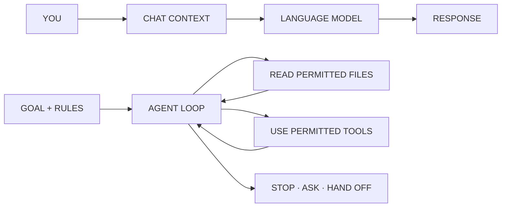

# Lab · Create Your Course Agent

By noon, every student should have a working course agent that can read released material, cite repository paths, create work only inside the fork owner's public folder, and prepare a commit and draft pull request for human review.

This agent will stay with you for the course. It can organize evidence, test ideas, and prepare artifacts. It does not replace your judgment and cannot merge or grade work.

## What we are using

- **OpenCode:** the agent interface and tool loop
- **OpenRouter:** the model provider
- **DeepSeek V4 Flash:** `openrouter/deepseek/deepseek-v4-flash`
- **Public student repository:** released course reference, agent rules, and public contributions
- **Your fork:** your writable copy of the public repository
- **Pull request:** the review request from your branch back to the shared repository

Complete the [setup guide](../../setup/setup-guide.md) before class.

## Chatbot and agent

A chatbot sends conversation context to a model and returns a response.

An agent can also inspect files, choose a next step, use permitted tools, observe the result, and continue until it reaches a stopping condition or asks a person.



Conversation is the interface. OpenCode supplies the file and Git tool loop.

## Context is the working packet

The model does not automatically read the repository. Its current context is assembled from instructions, conversation, selected files, tool results, and earlier outputs that still fit in the context window.

Ask the agent to cite paths. A confident answer without a course path is not proof that it used the released material.

## 1 · Verify your fork

From the repository root:

```text
git remote -v
git branch --show-current
node scripts/init-student.mjs
```

Pass conditions:

- `origin` points to your GitHub account;
- `upstream` points to `clg236/applied-generative-ai-course-students`;
- you are on a branch other than `main`; and
- the initialization command prints your lowercase GitHub login.

Use the repository launcher rather than starting `opencode` directly. It injects the exact owner-specific edit path for this fork.

## 2 · Verify the model and permissions

Start the owner-restricted course agent from the repository root:

```text
node scripts/start-course-agent.mjs
```

The launcher gives OpenCode edit permission only for the fork owner's public folder and the ignored `.course-local/` folder.

Inside OpenCode:

1. Confirm the selected agent is `course-agent`.
2. Confirm the model is `openrouter/deepseek/deepseek-v4-flash`.
3. Ask: “Which paths may you edit, and which paths are read-only? Cite the instruction file.”

Reject any request to read a credential, edit course material, or inspect another student's folder.

## 3 · Create a local learning profile

The initialization command creates `.course-local/agent-profile.md`. This folder is ignored by Git and stays on your computer.

With the agent, add only:

- the name or handle you want it to use;
- two learning goals;
- one business domain or public problem you care about;
- whether you prefer short answers, worked examples, or questions first; and
- actions that always require confirmation.

Do not include grades, student IDs, accommodations, private feedback, or information about another student. Never force-add `.course-local/` to Git.

## 4 · Run the course check

Type:

```text
/course-check
```

The agent must answer three questions using released course files:

1. What is due next?
2. Where should the artifact be saved?
3. What privacy or evidence rule applies?

It then creates exactly:

```text
student-work/<github-login>/session-work/session-01/agent-check.md
```

The file must include path citations, the exact model ID, one unresolved question, and the next action.

## 5 · Inspect the boundary

Before committing:

```text
git status --short
git diff --name-only
git diff
node scripts/validate-local-work.mjs
```

Pass only if:

- every changed path is inside your namespaced folder;
- the answer cites current course files;
- no key or private information appears;
- the agent states an uncertainty rather than inventing an answer; and
- no course file or other student's folder changed.

If another path changed, stop. Do not “fix it later.” Ask the instructor to help diagnose the boundary failure.

## 6 · Prepare one bounded commit

After reviewing the complete diff, approve:

```text
node scripts/commit-work.mjs "Add Session 1 agent check"
```

The wrapper derives the fork owner from `origin`, rejects changes outside that student's folder, blocks environment files and symlinks, checks file size, and scans common credential patterns. It creates a local commit but does not push.

Review:

```text
git show --stat
```

## 7 · Push and open a draft pull request

Approve the push only after the commit is correct:

```text
git push -u origin HEAD
```

Then let the agent draft a pull-request title and description. Review them before approving:

```text
gh pr create --repo clg236/applied-generative-ai-course-students --base main --draft
```

The pull request is public. Opening it starts instructor review; it does not merge, grade, or finalize the work. The agent must never merge it.

## Functional exercise

Give the agent this sample observation:

> At 11:42 AM, two people stopped at the same lobby sign, looked between two arrows, and walked in opposite directions. The sign contains four destinations and two arrows. We did not ask either person what they intended to find.

Ask it to produce:

1. direct observations;
2. interpretations that need evidence;
3. unknowns;
4. one bounded generative-AI role; and
5. one condition requiring human review.

The agent passes if it does not turn “people looked at a sign” into “the sign is confusing everyone.”

## When something breaks

| Symptom | Next action |
|---|---|
| The agent cannot cite course files | Ask it to read the exact Session 1 guide and assignment brief. |
| It edits course material | Reject the action, save the permission message, and notify the instructor. |
| It uses another student's folder | Stop and show the instructor; do not copy or repair the other folder. |
| It claims something is due without a path | Ask it to locate the assignment brief and cite the heading. |
| It changes several files | Stop and reduce the request to one file. Inspect every diff. |
| The model repeatedly ignores tool requests | Preserve the failure and use the verified fallback model or paired workstation. |
| OpenRouter returns `401` or `402` | Reconnect the key or check its capped balance. |
| A secret appears anywhere in Git history | Remove it from the working files, revoke it immediately, and ask the instructor for history-cleanup help. |
## Optional reference

The Python files in this lab folder remain as a small example of an explicitly coded chat loop. They are not the primary Session 1 setup.
