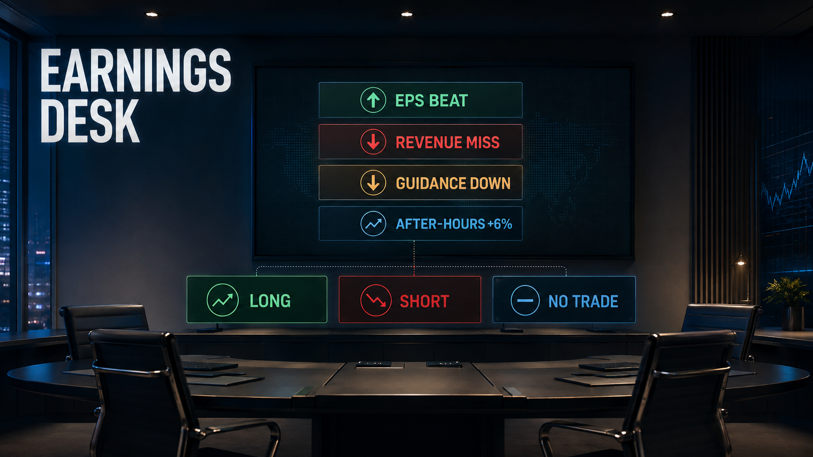

# Earnings Desk · A New icerynk Sim

This is a standard Product Requirement Document, adapted for Project 2.

The goal of a PRD is to explicitly define what a product should be, so that the thing you make is actually wanted and everyone building it works from the same description.

For Project 2 there is a third reason, and it is the one being marked: a PRD is where you show your judgment. Anyone can ask a model for a simulation. This document is where you prove your version is better, and give a reader a way to check.

## What a sim is

A sim is a real-time learning activity. It drops a player into a simulated situation, teaches them one thing, and makes them use it. The interactivity is what enforces the learning — there is no quiz at the end.

## Read this part before you start

You are designing one small teaching sim. Not a game, not a platform, not a curriculum.

Three tests. If your idea fails any of them, make it smaller before you write a word:

1. **One thing to learn.** You can say what a player understands afterwards that they did not before.
2. **One decision.** The room argues about a single question and answers it out loud.
3. **Fifteen minutes.** Start to finish, including the debrief.

## What it teaches

**After this run, a player can distinguish a headline earnings beat from a genuine expectations upgrade and defend a post-earnings trade decision.**

Observable mastery — pass = at least 3 of 4, including criterion 1.

| # | Evidence on the shared desk ticket |
| :--- | :--- |
| 1 | Names an expectation beyond headline EPS consensus. |
| 2 | Treats +6% as evidence—not the answer—and gives an alternative cause. |
| 3 | Cites both surfaced evidence IDs accurately, including E0 if the AI score was used. |
| 4 | States one concrete condition that would invalidate the thesis. |

## Overview

A browser-based, facilitator-light decision room. Fictional Nexora beats EPS, misses revenue, cuts guidance, yet rises 6% after hours. Players hold different roles, surface only two evidence cards, and make one Long / Short / No Trade decision before a branch-specific debrief.

## Goals

- Teach expectation-change reasoning — the headline is not the expectation.
- Force verbal synthesis: each role gives a first read; the room builds competing theses aloud.
- Make No Trade professionally valid — abstention can be disciplined, not cowardly.
- Assess process separately from P&L.
- Finish in 15 minutes.

## Non-Goals

- No full statements, DCF, order mechanics, sizing, portfolio, or live data.
- No personalized advice, prediction contest, or runtime generative AI.

## Audience

Undergraduate or early-career learners who know EPS, revenue, guidance, and Long / Short, but may still equate beat/miss with direction.

## Existing solutions and issues

| Approach | Why it is insufficient here |
| :--- | :--- |
| Lecture | Vocabulary without timed evidence reconciliation or negotiated disagreement. |
| Long case | All evidence + hindsight; too large for 15 minutes. |
| Ask AI | Collapses ambiguity, repeats headlines, and implies causes without provenance. |
| Paper trading | Rewards price path and risk-taking, not expectation-change reasoning. |

## Assumptions

| Assumption | Current evidence / validation gate |
| :--- | :--- |
| Learners anchor on EPS, guide direction, or +6%. | The no-context model baseline does; pilot pre-reads will code first statements for anchoring. |
| Too much data crowds out discussion. | Baseline proposes 12 metrics; ≥80% of pilot runs must preserve the final two-minute debrief. |
| Opposing routes can show equal mastery. | Expert judgment; two opposing pilot tickets should score within one rubric point. |
| Roles produce audible synthesis. | Design hypothesis; each pilot must contain ≥3 cross-role references before submission. |

## Constraints

- Exactly three beats (4 + 5 + 6 minutes).
- One final group trade.
- 3–5 players; shared browser room.
- Deterministic fictional data; no complex calculation.
- Final two-minute debrief inside Beat 3.
- Buildable by a small team in about two weeks.

## Key use cases

- Join and accept a role; give a first read.
- Spend two Evidence Tokens.
- Compare embedded expectations, guide quality, positioning, and valuation.
- Debate three routes; submit two evidence IDs plus one falsifier.
- Debrief process after an outcome.

## The card

**Title.** Earnings Desk.

**Subtitle.** Read the expectation change—not just the headline.

**Summary.** The headline is mixed, but Nexora Systems is up 6% after hours. Your 3–5-person desk has 15 minutes and only two Evidence Tokens to decide whether expectations truly improved. Debate the evidence, commit to Long / Short / No Trade, and defend the process before the debrief.

**Learning objective.** After this run, a player can distinguish a headline earnings beat from a genuine expectations upgrade and defend a post-earnings trade decision.

**Duration.** 15 minutes.

**Team size.** 3–5 players.

**Result.** One signed desk blotter: direction + 2 evidence IDs + 1 falsifier.

**Tags.** Expectations · Earnings Quality · Evidence · Risk · Team.

**Cover image and alt text.**

*Figure 1. AI-generated 16:9 catalog cover; accepted after the full-platform V1 image was rejected.*

## The run

**The only decision.** At 4:14 p.m., should the desk enter fictional Nexora Systems Long, Short, or No Trade at +6% after hours?

| Beat | Min | What the room sees | What the room does |
| :--- | :--- | :--- | :--- |
| 1 · Flash & Split | 4 | EPS $1.51 vs $1.42; revenue $4.72B vs $4.80B; FY guide $18.6–18.8B vs prior $19.1–19.4B; stock +6%; role cards; evidence menu locked. | Each role gives a 20-second first read. Facilitator asks, "What changed versus what was already expected?" No ticket is available. |
| 2 · Spend Evidence | 5 | E1 embedded expectations; E2 guide-quality bridge; E3 positioning / expected move; E4 valuation / uncertainty; tempting E0 AI Headline Score. | Spend exactly two Evidence Tokens. Place surfaced facts into upgrade / downgrade / ambiguous. Build competing Long, Short, and No Trade theses aloud; do not vote. |
| 3 · Commit & Debrief | 6 | One ticket: route, two evidence IDs, one-sentence thesis, one falsifier. After one submission: route vignette + three prompts. | Reach one shared decision; submit once. Use final two minutes to name the changed expectation, interpret what +6% can / cannot prove, and separate process from P&L. |

**The limit.** Two Evidence Tokens for the room; each surfaces one ID: E1–E4 or the tempting E0. Scarcity makes attention allocation visible and protects the 15-minute boundary.

**The tempting wrong move.** "Ask AI for Headline Score" costs one token and surfaces citable ID E0: "BULLISH 78/100," based only on EPS beat +6% and no sources. E0 keeps the ticket completable but crowds out incremental evidence.

**The endings — none is a failure.**

| Route | Outcome vignette | Debrief tension |
| :--- | :--- | :--- |
| LONG | Relief Holds: next-session +2%, but weak NRR complicates a profitable thesis. | Can positive P&L conceal weak expectation logic? |
| SHORT | Squeeze, Then Fade: +5% first, then a -7% close after NRR questions. | Can a sound thesis still have poor entry / path risk? |
| NO TRADE | Confirmation Cost: another +4% after a better bridge; capital preserved, opportunity missed. | Was abstention disciplined—or was the evidence bar too high? |

**Scoring rule.** The ticket—not the P&L sign—determines mastery. Outcomes are counterfactual teaching branches; the player's route does not cause the market path.

## Research

### Domain research

| Domain judgment | Direct product change |
| :--- | :--- |
| Consensus ≠ full expectation | E1 supplies buy-side whisper revenue and NRR, not another headline metric. |
| Guide direction ≠ guide quality | E2 reconciles the cut into a low-margin channel exit plus FX / timing, while separating organic demand and cash-margin guidance. |
| Price action ≠ causality | E3 frames +6% against prior drawdown, short interest, and the options-implied move. |
| Outcome ≠ process | Every route gets a tradeoff vignette; expectation framing, evidence, and falsifiability determine mastery. |

SEC / Investor.gov resources anchor the 8-K / 10-Q disclosure sequence and caution around adjusted non-GAAP metrics. All NXS facts and outcomes are fictional.

### Model research

**WHAT DOES IT PRODUCE WHEN ASKED TO DESIGN THIS?**

With only the simple prompt preserved in the ZIP, the first AI draft wrote: "Players inspect all twelve metrics before voting"; "Each student submits a private multiple-choice answer"; "The correct answer is Short"; and "students who shorted win." Those exact lines create cognitive overload, eliminate team interaction, invent certainty from ambiguous evidence, and reward hindsight.

## Part 7 · Why this beats just asking AI

### The bare prompt

The simple prompt used for the first draft is preserved in the ZIP alongside the unedited output and correction history. The draft's four load-bearing claims are reproduced below.

### What it produced

- "Players inspect all twelve metrics before voting."
- "Each student submits a private multiple-choice answer."
- "The correct answer is Short."
- "Students who shorted win."

### Where it fell short

| The model's line | What is wrong with it | How I know |
| :--- | :--- | :--- |
| "Players inspect all twelve metrics before voting." | Cognitive overload — attention is flooded, not allocated. | The scarce-token mechanic exists precisely because data volume crowds out discussion; the 12-metric baseline is the rejected alternative. |
| "Each student submits a private multiple-choice answer." | Eliminates team interaction — the learning lives in the debate, not a quiz. | Observable mastery requires audible, cross-role synthesis; a private vote can never produce it. |
| "The correct answer is Short." | Invents certainty from ambiguous evidence. | The scenario is deliberately mixed (beat + miss + guide cut); no route is derivable from the headline alone. |
| "Students who shorted win." | Rewards hindsight and outcome, not process. | The scoring rule grades the ticket, not the P&L sign; all three routes can pass the rubric. |

### What I supplied that it could not

The trading judgments: that +6% on mixed news is evidence of an expectation change, not a verdict; that guide direction and guide quality are different things; that price action does not equal causality. The scarcity mechanic (two tokens) that makes attention allocation visible. The process rubric that separates the decision from its outcome. The falsifier requirement that forces each route to state what would disprove it.

### The correction log

| AI proposed | I changed it to | Why |
| :--- | :--- | :--- |
| "Understand how earnings affect stock prices." | One observable expectation-change capability. | "Understand" cannot be scored. |
| "Inspect all twelve metrics." | Open only two of four evidence cards. | Scarcity teaches prioritization and protects time. |
| "Private multiple-choice answer." | Roles discuss; one shared desk ticket. | Learning occurs through interaction, not a quiz. |
| "The correct answer is Short." | All routes can pass one process rubric. | The trade is conditional on expectations and risk. |
| "Students who shorted win." | Three tradeoff debriefs; P&L ≠ mastery. | Removes hindsight and outcome bias. |

### The test a reader can run

Two-minute verification test:

| Time | Test |
| :--- | :--- |
| 0:00–0:30 | Count decisions and evidence: final = one shared trade + two cards; baseline mixes vote, sizing, stop, target, and quiz. |
| 0:30–1:15 | Offer a well-supported Long thesis: final rubric can pass it; baseline assigns Long zero. |
| 1:15–2:00 | Trace player speech: final names roles, evidence choices, competing theses, and one ticket; baseline is private voting. |

**Pass:** reviewer identifies the final design's one decision, evidence limit, group interaction, and process assessment in <2 minutes; at least two are missing or contradictory in the baseline.

## Part 8 · Generative AI outputs

| Output | Modality / model | Date | Rejected V1 → human action |
| :--- | :--- | :--- | :--- |
| Simulation text | Text — OpenAI GPT-5 (Codex) | 2026-08-03 | 12 metrics / quiz / unique Short → three beats, tokens, roles, expectation layers, falsifier, process rubric. |
| Catalog cover | Image — OpenAI image_gen.imagegen; backend ID not exposed | 2026-08-03 | Dense solo dashboard → 16:9 card art with equally weighted routes and no platform controls. |

**Disclosure.** Full prompts, unedited output, rejected artifacts, and correction history are in the ZIP. No API key was used or stored. AI assisted with drafting and image generation; Jiafeng Wu supplied the trading judgments, made rejection / scope decisions, selected the final outputs, and is responsible for the submission.

## Two-week implementation envelope

Static browser room with six views (card, lobby / roles, three beats, debrief), deterministic JSON, timer, local session state, two-token enforcement, one ticket, three route vignettes, keyboard support, and event logging. No brokerage, live data, auth, open-ended AI, or complex math.

- Days 1–2: content / wireframes
- Days 3–6: three-beat UI
- Days 7–8: branching / telemetry / accessibility
- Days 9–10: QA + pilot

**Acceptance:** 3–5 players finish in 15 ± 2 minutes; exactly three beat transitions; one final ticket; token limit enforced; all debrief routes accessible; ≥80% of pilot teams reach the final two-minute debrief.
