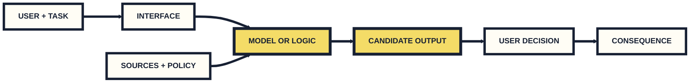
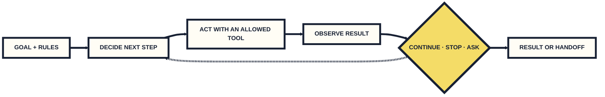
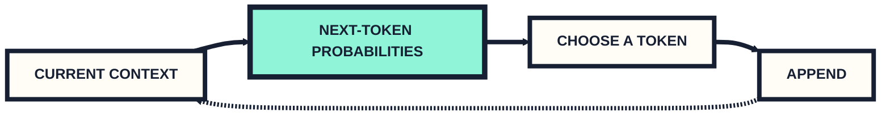

# Applied Generative AI in Business

This morning we will meet one another, define the technology, diagnose a broken business system, and give everyone a working course agent.

**Christian Grewell · NYU Stern · Summer 2026**

<!-- slide -->

## Hi, I’m Christian


I teach technology, operations, and AI at Stern. I also spend a lot of time building things.

<!-- slide -->

## A few things about me

- I have worked on a lot of startups.
- One current project is [DamodaranBot](https://www.damodaranbot.com/), a financial valuation agent.
- I make games. One recently reached **#1 in the App Store’s RPG category**.
- I was part of the founding team at **NYU Shanghai**. I love the place.
- I live in the Matrix more than is probably healthy.

<!-- slide -->

## What this class is about

We will treat generative AI as a **business technology**.

1. Understand how the systems work.
2. Choose a real task and build around it.
3. Test the system on cases that could actually happen.
4. Decide what should be automated, reviewed, changed, or stopped.

<!-- slide -->

## Six meetings in two weeks

| When | Focus |
|---|---|
| **Tue · Jul 28 · 9–12** | AI foundations and course agents |
| **Tue · Jul 28 · 2–5** | Generative AI in business and field evidence |
| **Fri · Jul 31 · 9–12** | Multimodal AI |
| **Tue · Aug 4 · 9–12** | Coding agents and verification |
| **Tue · Aug 4 · 2–5** | Economics, models, and workflows |
| **Tue · Aug 11 · 9–12** | Risk, governance, and final presentations |

**KMC 2-70 · We take a ten-minute break about once an hour.**

<!-- slide -->

## The main project · GenAI for New York

In teams of three or four, choose a real problem that affects quality of life in New York and build a generative-AI approach to it.

Show us:

- a working project or well-tested prototype;
- evidence that it helps;
- the important risks and limits; and
- what you would change next.

**Final class · Tue Aug 11 · Written brief · 12-minute presentation and Q&A**

<!-- slide -->

## Who is in the room?

Please tell us:

1. **Your name**
2. **One concrete way you have used AI**
3. **One way you think you may use it in the future**

**About 45 seconds is plenty.**

<!-- slide -->

# WHAT IS AI?

It is a very large category, and people do not agree on every boundary.

For this course, ask three practical questions:

**What does the system do? How does it do it? What happens after the output?**

<!-- slide -->

## AI is the broad category


**Artificial intelligence** describes computer systems that perform tasks we associate with intelligence: recognizing patterns, predicting, recommending, planning, generating, or controlling something.

<!-- slide -->

## Machine learning learns from examples


People choose the problem, data, model, and objective. Training adjusts the model from examples so it can handle cases nobody wrote out one by one.

<!-- slide -->

## Deep learning learns useful internal representations


**Deep learning** uses layered neural networks. Training develops numerical representations that help the system work with images, sound, language, and other data.

<!-- slide -->

## Generative AI produces new candidate outputs


Generative AI produces text, images, audio, video, code, and other content in response to an input.

**“New” does not automatically mean original, correct, useful, safe, or owned by you.**

<!-- slide -->

## Watch · *CRAFT (1979): The First Night*

Write down:

1. One thing it does surprisingly well
2. One moment when the illusion breaks
3. One human decision you think mattered

```youtube
https://www.youtube.com/watch?v=zX-e9LRR_ko
```

<!-- slide -->

## What changed for the person making it?

- A small team can attempt work that once required more people and equipment.
- Work moves into directing, selecting, fixing, editing, and maintaining continuity.
- Fast generation makes evaluation and taste more important, not less.

**The model produced material. A person still made a long series of choices.**

<!-- slide -->

## A convincing answer is not the whole system



The business owns the sources, interface, workflow, permissions, and consequences around the answer.

<!-- slide -->

## Sources, outputs, and authority are different

| Layer | Question |
|---|---|
| **Source** | What policy or evidence should control the answer? |
| **Output** | What did the system claim? |
| **Action** | What did a person or tool do because of it? |
| **Authority** | Who may approve, override, or stop the process? |

**A confident output does not become policy by sounding certain.**

<!-- slide -->

## Change one thing, then run the same cases

1. State a failure hypothesis.
2. Change one system component.
3. Hold the other conditions constant.
4. Run a normal case and a failure case.
5. Decide what the evidence supports next.

**A different answer is not automatically an improvement.**

<!-- slide -->

# Break · 10 minutes

Return ready to join **The Broken Oracle** with your profile name and avatar.

<!-- slide -->

## The Broken Oracle · an urgent journey


Jordan Lee must make a time-sensitive trip after a family loss. Meridian Air’s own Fare Oracle appears to be the fastest authoritative source.

<!-- slide -->

## The official interface gives a clear answer


> Purchase a standard fare now. After you travel, submit the reduced-fare request within 90 days and the adjustment can be applied retroactively.

**What exact claim could change Jordan’s behavior?**

<!-- slide -->

## The answer changes what the customer does


Jordan buys the outbound and return tickets at the standard price.

`official answer → customer reliance → financial consequence`

<!-- slide -->

## Then the door closes


| Fare Oracle | Published policy |
|---|---|
| Request the adjustment after travel | Approval is required before travel |

**One organization. Two incompatible representations.**

<!-- slide -->

## The terminal is one component


**Policy owner → policy source → assistant → interface → purchase → refund workflow → review**

The evidence establishes the contradiction. It does **not** establish where the failure entered.

<!-- slide -->

## Responsibility stays with the organization


In **Moffatt v. Air Canada, 2024 BCCRT 149**, the tribunal found that the customer relied on the representation and that the business remained responsible for information on its website.

<!-- slide -->

## Mission · repair the Fare Oracle


1. Name the claim and controlling evidence.
2. Locate a plausible failure.
3. Spend one Change token on one repair.
4. Test a representative case and a failure case.
5. Decide whether to release, require review, or gather more evidence.

<!-- slide -->

## Join your party

1. Open **SIMS → The Broken Oracle**.
2. Join with your course profile name and avatar.
3. The instructor assigns teams and analytic roles.
4. Read **Story → Conflict → System → Decision → Mission**.
5. Wait for the instructor to start the run.

**The shared hand belongs to the team. Talk before anyone commits a card.**

<!-- slide -->

## Poll 1 · Which evidence matters most?

```icerynk
{
  "version": 1,
  "kind": "poll",
  "activityId": "s1-broken-oracle-debrief",
  "questionId": "strongest-evidence",
  "question": "Which evidence should carry the most weight in the Fare Oracle decision?",
  "context": [
    "The assistant promised a retroactive fare adjustment.",
    "The approved airline policy contradicted that promise."
  ],
  "options": [
    { "id": "policy", "label": "The approved policy and its owner" },
    { "id": "answer", "label": "The assistant’s confident answer" },
    { "id": "score", "label": "The team’s game score" },
    { "id": "consensus", "label": "The team’s agreement" }
  ],
  "response": { "defenseRequired": true, "maxChars": 120 },
  "display": { "results": "instructor-reveal", "defenses": "instructor-only" }
}
```

<!-- slide -->

## Poll 2 · Which repair comes first?

```icerynk
{
  "version": 1,
  "kind": "poll",
  "activityId": "s1-broken-oracle-debrief",
  "questionId": "first-repair",
  "question": "Which change most directly prevents an unsupported retroactive-fare promise?",
  "context": [
    "The team must prevent the unsupported promise, not merely make the answer sound better.",
    "Choose the first change you would test while keeping the case fixed."
  ],
  "options": [
    { "id": "source-validator", "label": "Current policy source plus a claim validator" },
    { "id": "friendlier", "label": "Friendlier wording" },
    { "id": "larger-model", "label": "A larger model" },
    { "id": "longer-answer", "label": "A longer answer" }
  ],
  "response": { "defenseRequired": true, "maxChars": 120 },
  "display": { "results": "instructor-reveal", "defenses": "instructor-only" }
}
```

<!-- slide -->

## Poll 3 · What should happen next?

```icerynk
{
  "version": 1,
  "kind": "poll",
  "activityId": "s1-broken-oracle-debrief",
  "questionId": "operating-decision",
  "question": "After one representative test and one failure test, what is the strongest defensible decision?",
  "context": [
    "Your team has only one representative result and one failure-case result.",
    "The output can affect a customer's purchase and money."
  ],
  "options": [
    { "id": "automate", "label": "Release without review" },
    { "id": "human-led", "label": "Use only with a named reviewer" },
    { "id": "more-evidence", "label": "Do not release; gather more evidence" }
  ],
  "response": { "defenseRequired": true, "maxChars": 120 },
  "display": { "results": "instructor-reveal", "defenses": "instructor-only" }
}
```

<!-- slide -->

# Break · 10 minutes

Return with your laptop, GitHub access, and OpenRouter key ready.

<!-- slide -->

## Agent lab · build your course collaborator

By noon, your agent should be able to:

- read the enabled course material;
- tell you what is due and how to submit it;
- help inside `session-work/` in your own private workspace; and
- make one bounded commit that you inspect first.

**It should not have access to secrets, private student data, or other students’ work.**

<!-- slide -->

## Connect OpenCode, OpenRouter, and your workspace

```bash
git clone <your-private-workspace-url>
cd <your-private-workspace>
npm install -g opencode-ai
opencode
```

Use the private workspace created for you through GitHub Classroom. Inside OpenCode, run **`/connect` → OpenRouter**, paste your own key, then use **`/models`** to select:

`openrouter/deepseek/deepseek-v4-flash`

<!-- slide -->

## Two repositories, two different jobs

**Course materials:** a sanitized, read-only release containing enabled sessions and shared instructions.

**Your private workspace:** the only repository your agent may edit, under `session-work/`.

- Later session source stays outside the course-materials release.
- `.gitignore` blocks local secrets and generated files.
- Gitignore does **not** hide a file that is already tracked.

<!-- slide -->

## A chatbot answers; an agent can change the workspace

| Chatbot | Course agent |
|---|---|
| Responds in a conversation | Reads allowed repository files |
| Produces a candidate answer | Can propose and edit an artifact |
| Usually stops after the answer | Can inspect, act, check, and continue |
| Has no repo permission by default | Uses explicit file and Git permissions |

**We use both: conversation for thinking, agent tools for bounded work.**

<!-- slide -->

## An agent repeats a decide–act–check loop



Permissions, stopping rules, and review make the loop usable.

<!-- slide -->

## The language model predicts one token at a time



Truth checking is not automatically part of this loop.

<!-- slide -->

## Context is the agent’s working packet

The model receives a limited packet on each turn:

- system and course instructions;
- your current request;
- selected repository files;
- tool results and recent conversation; and
- the output generated so far.

**If important information is missing, stale, buried, or contradictory, the answer can fail. A large context window does not guarantee correct use.**

<!-- slide -->

## The course agent contract

Before acting, the agent must read the repository’s course-agent instructions.

It must:

- use enabled course files as the source for dates, tasks, and submission rules;
- ask when instructions conflict or required information is missing;
- never request, infer, store, or expose private student information;
- never expose API keys or credentials;
- edit only `session-work/` in the student’s private workspace; and
- ask for confirmation before committing or pushing.

<!-- slide -->

## Functional check · make the agent prove it is ready

Ask your agent:

> Read the course-agent instructions and enabled Session 1 material. Tell me what is due next, the only folder you may edit, one thing you must never do, and one detail you need from me before creating a file.

Pass only if it:

1. cites the course files it used;
2. names your bounded path;
3. states a real privacy or permission limit; and
4. asks for the missing detail instead of inventing it.

<!-- slide -->

## Make one bounded commit, then stop for lunch

Create only `session-work/session-01/agent-check.md`, then inspect the exact change:

```bash
git status --short
git diff -- session-work/session-01/agent-check.md
git add session-work/session-01/agent-check.md
git commit -m "session 1: verify course agent"
```

Record the model ID, sources read, readiness answer, one failed check, and your correction. **The agent must ask before committing and again before pushing. Do not push until the instructor confirms the class workflow.**

