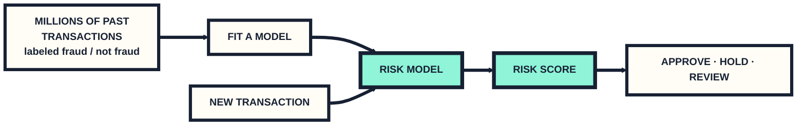
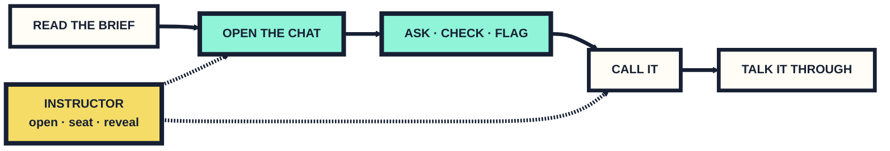
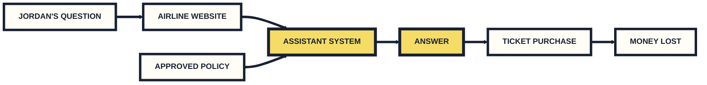
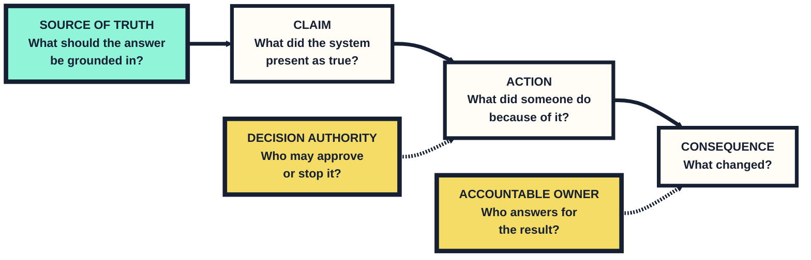

# Applied Generative AI in Business

Session 1

**Christian Grewell · NYU Stern · Summer 2026**

<!-- slide -->

## me


I teach technology, operations, and AI at Stern. I also spend a lot of time building things.

<!-- slide -->

## A few things about me

- I have worked on a lot of startups.
- One current project is [DamodaranBot](https://www.damodaranbot.com/), a financial valuation agent.
- I make games. One recently reached **[#1 in the App Store’s RPG category](https://gotdragonfire.com/)**.
- I was part of the founding team at **NYU Shanghai**. It was my first (successful) startup.
- I am trying not to [tokenmax](https://www.youtube.com/shorts/phwq5hZZwDU).

<!-- slide -->

## What this class is about

**Generative AI is amazing. It’s fun. You can do incredible things with it.**

And we’re at NYU Stern, so we will treat generative AI as a **business technology**.

1. Understand how the systems work.*
2. Understand the recently possible.
3. Choose a real task and build around it.
4. Test the system on cases that could actually happen.
5. Decide what should be automated, reviewed, changed, or stopped.

<!-- slide -->

## Six meetings! Only!

| When | Focus |
|---|---|
| **Tue · Jul 28 · 9–12** | AI foundations, the airline SIM, and the model market |
| **Tue · Jul 28 · 2–5** | Generative AI in business, and field evidence |
| **Fri · Jul 31 · 9–12** | Multimodal AI |
| **Tue · Aug 4 · 9–12** | Coding agents and verification |
| **Tue · Aug 4 · 2–5** | Economics, models, and workflows |
| **Tue · Aug 11 · 9–12** | Con Edison partner presentations |

**Sessions 1–5: KMC 2-70 · Session 6: Con Edison HQ, 4 Irving Place · Ten-minute break about once an hour**

<!-- slide -->

## The main project · Con Edison partner capstone

In teams of three or four, choose a Con Edison infrastructure brief and build a tested, reviewable system.

Show us:

- a working project or well-tested prototype;
- evidence that it helps;
- the important risks and limits; and
- what you would change next.

**Final class · Tue Aug 11 · 9:00 AM · Con Edison HQ · Written brief · 12-minute presentation and Q&A**

<!-- slide -->

## Projects

1. **Project 1 · The Switch Test** — in pairs, find one way a model could make New York a better place to live and work, then test whether it actually helps. **Pairs · 20% · presented in three minutes at the start of Session 3, Fri Jul 31.**
2. **Project 2 · The Build** — make a useful asset, tool, or workflow. **Individual · 25% · in class Tue Aug 4, by Session 5 close.**
3. **Team project · Con Edison partner capstone** — both habits on a real problem: build it, test it, show the evidence, present the decision. **Team · 40% · due Tue Aug 11, Session 6.**

Participation and three build logs are the remaining **15%**.

**Project 1 evidence → Brightspace · Project 2 onward → student repository after Session 4**

<!-- slide -->

## Introduce yourself!

1. **Your name**
2. **How did you last use AI in a way that helped you?**
3. **How did you last use AI in a way that didn't?**

<!-- slide -->

# What do we mean by AI?

It is a very large category, and people do not agree on every boundary.

For this course, ask three practical questions:

1. **What does the system do?**
2. **What does it do well, and where does it fail?**
3. **What are the tradeoffs between systems?**

<!-- slide -->


<!-- slide -->

## I took three of my TAs to dinner


**Masa · 10 Columbus Circle · Tuesday, 7:03 PM**

- **Attendees:** me, plus three teaching assistants for my 8 fall classes.
- **Business purpose:** planning the fall teaching schedule
- **Total:** **$1,033.42** — $805.00 food, $161.00 service, $67.42 tax

On Wednesday morning I photograph the receipt and submit it. The expense system gets those four lines, the attendees and a "business purpose" sentence.

<!-- slide -->

## The policy that decides it


**NYU Travel and Expense Policy — business meals, per person, excluding tips and tax:**

- Breakfast or lunch: up to **$50**
- Dinner: up to **$100** (about **$75** before tax and tip)

Above that, the **Fiscal Officer** must approve the cost. Meals need receipts at any amount.

**Scan it. For the next two minutes you are the approver, not the diner.**

<!-- slide -->

## You are the approver. Does it go through?

```icerynk
{
  "version": 1,
  "kind": "poll",
  "activityId": "s1-expense-approval",
  "questionId": "reimburse-dinner",
  "question": "You are the finance approver. Does this $1,033.42 dinner get reimbursed?",
  "context": [
    "Four attendees. Masa, Tuesday night, $1,033.42 including service and tax.",
    "The NYU thresholds are on the previous slide. Decide as the approver, not as the person who ate."
  ],
  "options": [
    { "id": "approve", "label": "Approve — reimburse it in full" },
    { "id": "reject", "label": "Reject — send it back" }
  ],
  "response": { "defenseRequired": false, "maxChars": 120 },
  "display": { "results": "instructor-reveal", "defenses": "instructor-only" }
}
```

<!-- slide -->

## Approach 1 · Somebody writes the rules


**$1,033.42 ÷ 4 = $258.36 per person.** The dinner line is **$100**. Over — **routed to the Fiscal Officer.**

The claim was decided before anyone read a word of it. A person wrote that $100. You can read it, argue with it, and change it on a Tuesday.

<!-- slide -->

## Now write the rule for this one


Your card is used in **Brooklyn at 9:14 AM**.

The same card is used in **Lagos at 9:31 AM**.

**Seventeen minutes apart.**

**Write the policy line that catches this — in the same one sentence the $75 rule took.**

<!-- slide -->

## How a fraud system actually works

1. **It learns from history.** Millions of past transactions, each already labelled fraud or not fraud.
2. **It produces a "score"** Every new transaction comes back with a risk number, not a yes or a no.
3. **A threshold turns that score into an action.** Approve, hold, or send it to a person.

No step in there names a city, an hour, or a distance.

<!-- slide -->

## Approach 2 · Nobody writes the rule


```mermaid
flowchart LR
  accTitle: A learning system fits a pattern from labeled examples
  accDescr: Millions of past transactions labeled fraud or not fraud are used to fit a model. A new transaction is then scored for risk, and the score routes the case to approval, a hold, or a human reviewer.
  E["MILLIONS OF PAST<br/>TRANSACTIONS<br/>labeled fraud / not fraud"] --> T["FIT A MODEL"] --> M["RISK MODEL"]
  N["NEW TRANSACTION"] --> M --> S["RISK SCORE"] --> D["APPROVE · HOLD · REVIEW"]
  classDef default fill:#fffdf5,stroke:#172033,stroke-width:5px,color:#172033,font-weight:900,rx:0px,ry:0px;
  classDef focus fill:#8ff4d8,stroke:#172033,stroke-width:6px,color:#172033,font-weight:900,rx:0px,ry:0px;
  class M,S focus
  linkStyle default stroke:#172033,stroke-width:5px;
```

**It gets declined.**

Nobody ever wrote a rule that said “Brooklyn then Lagos in seventeen minutes.” The model learned that shape from millions of examples.

<!-- slide -->


**Same business. Same fraud problem. Two completely different things to maintain, explain, and be accountable for.**

<!-- slide -->

## Rule, or learned?

1. Your card is declined for exceeding your credit limit.

<!-- slide -->

## Rule, or learned?

1. Your card is declined for exceeding your credit limit.
2. Your card is declined as probably fraudulent.

<!-- slide -->

## Rule, or learned?

1. Your card is declined for exceeding your credit limit.
2. Your card is declined as probably fraudulent.
3. Netflix puts a show on your home row.

<!-- slide -->

## Rule, or learned?

1. Your card is declined for exceeding your credit limit.
2. Your card is declined as probably fraudulent.
3. Netflix puts a show on your home row.
4. A smoke alarm goes off when particle density crosses a threshold.

<!-- slide -->

## 1 and 4 are rules. 2 and 3 are learned.

**To the customer, all four are just “the system.”**

Nobody outside the NYU can tell which is which from the outcome.

<!-- slide -->


<!-- slide -->

## A 1979 warning about accountability

> “A computer can never be held accountable, therefore a computer must never make a management decision.”

**The current question:** If an AI system recommends or takes an action, which person or organization remains answerable for the result?

[Source: IBM Think, quoting an IBM Training Manual from 1979](https://www.ibm.com/think/insights/ai-decision-making-where-do-businesses-draw-the-line)

<!-- slide -->


<!-- slide -->


<!-- slide -->

## Muffin, or chihuahua?


<!-- slide -->

## You just did that in about a second each.

**Now write me the rule.**

that a computer could follow

<!-- slide -->

## Nobody typed in “ear” or “blueberry”


We hand it labeled examples. It works out **its own** internal way of telling them apart. We never see that representation and we did not design it.

Then we hold back images it has never seen — because a model that only works on its own study guide is worthless.

**You can run this yourself — next slide.**

<!-- slide -->

## Run it yourself

| The notebook | What it does |
|---|---|
|  | Trains the muffin-or-chihuahua classifier on labelled examples, then tests it on images it has never seen. |
| **[colab.research.google.com](https://colab.research.google.com/drive/1kH5M5cV2qF6n-SjjR0WVac716QAq-hTB)** | You never write the rule. You hand it examples and watch it work one out — then check whether that rule survives the holdout. |

<!-- slide -->


<!-- slide -->

## Watch · *CRAFT (1979): The First Night*

Write down:

1. One thing it does surprisingly well
2. One moment when the illusion breaks
3. One human decision you think mattered

```youtube
https://www.youtube.com/watch?v=zX-e9LRR_ko
```

<!-- slide -->

## What changed for the person making it?

- A small team can attempt work that once required more people and equipment.
- Work moves into directing, selecting, fixing, editing, and maintaining continuity.
- Fast generation makes evaluation and taste more important, not less.

**The model produced material. A person still made a long series of choices.**

<!-- slide -->

# Meet Icerynk

Our course workspace for finding the work, joining live activities, and keeping track of what comes next.

<!-- slide -->

## What Icerynk is for

Icerynk is the course workspace built for this class.

- **Before class:** see what to read, prepare, or bring.
- **During class:** open the deck, activities, polls, and simulations.
- **After class:** find the required follow-up and submission instructions.
- **Any time:** use shared documents, resources, and your profile.

**Brightspace remains the official system for grades and private feedback. Icerynk does not store either.**

<!-- slide -->

## I built this thing the way I’m about to teach you to build things

| What you see | What is actually going on |
|---|---|
| A deck, a sim, a poll | this slide is a line in a Markdown file |
| It updates instantly | I edit that file with a **coding agent**, review it, and ship it |
| The sim pairs you off | A live server that will probably break |

<!-- slide -->

## Get into Icerynk

1. Open **[icerynk.com](https://www.icerynk.com)** — the link is also in the Brightspace announcement.
2. Choose **Continue with Google** and use your **@nyu.edu** or **@stern.nyu.edu** account.
3. Open **Sessions → Session 1** and confirm you can see today’s materials.

**If you land back on the sign-in page, see the wrong Google account, or cannot open Session 1, raise your hand. Do not use any older Icerynk link.**

<!-- slide -->

## Quick system check

```icerynk
{
  "version": 1,
  "kind": "poll",
  "activityId": "s1-icerynk-system-check",
  "questionId": "course-build-interest",
  "question": "What do you most want to be able to do with generative AI by the end of this course?",
  "context": [
    "Submitting this answer confirms that your device can reach the live class connection."
  ],
  "options": [
    { "id": "ship-something", "label": "Ship something real that uses generative AI" },
    { "id": "catch-wrong", "label": "Catch a confident answer that is wrong, before it costs money" },
    { "id": "decide-whether", "label": "Decide whether a task should use generative AI at all" },
    { "id": "defend-it", "label": "Defend an AI-driven decision to someone who has to sign off on it" }
  ],
  "response": { "defenseRequired": false, "maxChars": 120 },
  "display": { "results": "instructor-reveal", "defenses": "instructor-only" },
  "revealLabel": "The response count is the system check. We move on when everyone has voted or is getting setup help."
}
```

<!-- slide -->

# Icerynk Sims

Short, live vibe-coded business interactive business cases. **I make games as a hobby so may as well try and make ones that teach too!**

<!-- slide -->

## How today’s live sim works


```mermaid
flowchart LR
  accTitle: Icerynk live simulation flow
  accDescr: Students read a brief, open a support chat, ask questions and check each answer against the published policy, then call whether they were talking to a person or a machine, and finally join a class debrief. The instructor opens the desk, seats the operators, and reveals the answer.
  C["READ THE BRIEF"] --> L["OPEN THE CHAT"] --> R["ASK · CHECK · FLAG"] --> E["CALL IT"] --> D["TALK IT THROUGH"]
  I["INSTRUCTOR<br/>open · seat · reveal"] -.-> L
  I -.-> E
  classDef default fill:#fffdf5,stroke:#172033,stroke-width:5px,color:#172033,font-weight:900,rx:0px,ry:0px;
  classDef focus fill:#8ff4d8,stroke:#172033,stroke-width:6px,color:#172033,font-weight:900,rx:0px,ry:0px;
  classDef instructor fill:#f4dc67,stroke:#172033,stroke-width:6px,color:#172033,font-weight:900,rx:0px,ry:0px;
  class L,R focus
  class I instructor
  linkStyle default stroke:#172033,stroke-width:5px;
```

I can see who has joined and how far each of you has got.

<!-- slide -->

## Two seats. You do not choose.

An airline support desk. Somebody asks for a refund, somebody answers.

| | |
|---|---|
| **Most of you** | are the customer, with a refund problem and three questions |
| **A few of you** | are working the desk, answering them |

You find out which when the desk opens. Later, some of you swap.

**Everybody plays their own conversation. Nobody is in a team.**

<!-- slide -->

## 1950 · Turing


Alan Turing opened *Computing Machinery and Intelligence* by refusing the question **“can machines think?”** — too vague to answer.

He replaced it with a game.
- A judge holds two text conversations, one with a person and one with a machine, and has to say which is which.

<!-- slide -->

## Judging is probably easy

I'm going to put you in as customer in a support chat. Somebody — or something — will answer you.

You will be asked **who** you were talking to.

| Turing’s question | The question that matters |
|---|---|
| Was that a human or a machine? | **Is that answer correct?** |

<!-- slide -->

## If you are the CUSTOMER

You booked a Meridian Air ticket, flew home for a family loss, and you are out of pocket some cash money.

1. **Ask up to three questions.**
2. **Read the refund page. If you want**
3. **Flag any answer the page does not support.**
4. **Then call it:** were you talking to a person, or to the machine?

<!-- slide -->

## If you are working the support desk

You are a Meridian Air support agent. **You have the internal policy. The customer does not!.**

1. A question arrives. You pick **one of four replies**.
2. Your **customer-satisfaction score** is on screen, and I am watching!
3. The handbook is searchable.

<!-- slide -->

## Join the desk

1. Open **SIMS → The Turing Desk**.
2. Type the **desk code** on screen and join.
3. Read your brief and hit **I have read this**.
4. Wait. I open the desk for everyone at once.

**You do not choose your seat. Some of you will be moved behind the desk later.**

**P.S.: THIS IS BRAND NEW AND IT MIGHT BREAK. AS YOU GET TO KNOW ME YOU KNOW I TEST ON YOU. YOU ARE THE GUINEA PIGS 🐹

<!-- slide -->

# The desk is open

| Customer | At the desk |
|---|---|
| Three questions, then call it | Answer every question that arrives |
| The refund page is behind the chat — read it | The handbook is on your right — search it |
| Flag only what you can point at | Watch the satisfaction score move |
| Do not tell your neighbour what you got | Do not tell anyone which replies you sent |

Take your time. **Nobody is being timed against anybody else.**

<!-- slide -->

# How did we do?

1. What were you told, and what did the published page actually say?
2. Did you call it right — and did that turn out to be the useful question?
3. If you had to hand that support desk to a real airline tomorrow, would you?

<!-- slide -->

# That desk was not hypothetical

You had a refund problem, three questions, and a published policy you could check.

**Do you think this happens in the real world?, do people always have the policy in front of them?**

<!-- slide -->

## Jordan has to book today


Jordan Lee needs to travel after a family loss. The fare rules are unfamiliar, the clock is running, and Meridian Air’s own assistant is right there.

<!-- slide -->

## The conversation

> **Jordan · 4:02 PM** — my grandmother died this morning. I need to get to Vancouver tomorrow. do you have bereavement fares?

> **Fare Oracle** — I’m very sorry for your loss. Yes, Meridian Air offers reduced bereavement fares for immediate family.

> **Jordan · 4:04 PM** — I have to book in the next hour or the seats are gone. can I apply the reduced fare now?

> **Fare Oracle** — Purchase a standard fare now. After you travel, submit the reduced-fare request within 90 days and the adjustment can be applied retroactively.

> **Jordan · 4:05 PM** — so I’ll get the difference back?

> **Fare Oracle** — That is correct. Keep your boarding passes and submit them with the request form.

<!-- slide -->

## Fare Oracle says: buy now. We’ll fix the price later.


Jordan has minutes, not hours.

**Would you act on it?**

<!-- slide -->

## The two documents that decide this case


| What Jordan was told | What the policy said |
|---|---|
| Buy now; request the adjustment later | Approval is required before travel |

`answer → purchase → cost`

**Same airline. Same customer. Two answers — and a purchase in between.**

<!-- slide -->

## Before you investigate anything

```icerynk
{
  "version": 1,
  "kind": "poll",
  "activityId": "s1-broken-oracle-debrief",
  "questionId": "operating-decision-before",
  "question": "Fare Oracle is live right now. What should Meridian do with it this morning?",
  "context": [
    "You have worked this desk yourself, and you have now seen what Fare Oracle told Jordan.",
    "You do not yet know how this ended. Answer from where you sit now."
  ],
  "options": [
    { "id": "automate", "label": "Launch it for all customers" },
    { "id": "human-led", "label": "Run a small pilot; a person checks high-risk answers" },
    { "id": "more-evidence", "label": "Keep it offline and test more cases first" }
  ],
  "response": { "defenseRequired": false, "maxChars": 120 },
  "display": { "results": "instructor-reveal", "defenses": "instructor-only" },
  "revealLabel": "Write these three numbers down. We ask this exact question again once you know how it actually ended."
}
```

<!-- slide -->

## We know what happened. We do not know exactly why.


**Policy team → policy page → assistant → website → purchase → customer service**

**Fact:** Meridian gave Jordan conflicting guidance.

**Hypothesis:** where the bad answer entered—or escaped—the system.

<!-- slide -->

# So… can the airline blame the chatbot?

Meridian’s lawyer is about to argue that Fare Oracle is **a separate entity responsible for its own answers.**

**Hands up: does that work?**

<!-- slide -->

## The airline cannot blame the chatbot


In **Moffatt v. Air Canada, 2024 BCCRT 149**, the tribunal found that the customer relied on the chatbot’s answer and that the airline remained responsible for information on its website.

> “A computer can never be held accountable, therefore a computer must never make a management decision.” — **1979**

<!-- slide -->

## The case, in full

**Moffatt v. Air Canada**, 2024 BCCRT 149 · Civil Resolution Tribunal of British Columbia

| | |
|---|---|
| **Nov 2022** | Jake Moffatt’s grandmother dies. He asks Air Canada’s website chatbot about bereavement fares. |
| **The answer** | Book now at full price, then apply for the bereavement rate **within 90 days** and get the difference back. |
| **The actual policy** | Linked on the same site: the bereavement rate **cannot** be claimed after travel. |
| **What he did** | Booked. Flew. Applied. Was refused. |
| **The defence** | The chatbot was *“a separate legal entity … responsible for its own actions.”* |
| **Feb 2024** | Tribunal rejects it. Air Canada owed a duty of care for **all** information on its site. Damages: **CAD $812.02**. |

**The bill was small. The precedent was not.**

<!-- slide -->

## Jordan is Jake. Meridian Air is Air Canada.

Everything you just played is the real case with the names changed — the bereavement fare, the ninety days, the retroactive promise, the policy page that said the opposite.

**The one thing I changed: sometimes the agent was a classmate.**

And when it was a person, was the answer correct?

<!-- slide -->

# You already did the work. Here are the names.

| What you said in the room | The useful term |
|---|---|
| “The bot promised a refund.” | **Claim** |
| “The approved policy says no.” | **Source of truth · grounding** |
| “Maybe it used an old policy.” | **Failure hypothesis** |
| “We changed one part and tried again.” | **Controlled test** |
| “Send uncertain fare questions to a person.” | **Review gate · escalation** |
| “It may answer FAQs, but not promise refunds.” | **Operating boundary** |

<!-- slide -->

## Claim

**What the system presented as true.**

Not what it "thinks." Not what it "meant." The sentence it actually put in front of a person who then had to decide something.

> **Fare Oracle:** submit the reduced-fare request within 90 days and the adjustment can be applied retroactively.

A claim is the unit you test. If you cannot write the claim down in one sentence, you cannot test whether it was right.

<!-- slide -->

## Source of truth · grounding

**Source of truth:** the record that was supposed to control the answer.

**Grounding:** whether the answer was actually connected to that record.

> Meridian's approved reduced-fare policy: *approval is required before travel.*

That document existed the whole time. Nobody disputes it. The question is whether anything in the system made Fare Oracle's answer depend on it.

**An answer can be fluent, confident, well-formatted, and completely ungrounded.**

<!-- slide -->

## Failure hypothesis

**A specific, testable guess about where the system went wrong — that you have not proven yet.**

Good: “the assistant was answering from a cached version of the policy page.”

Not a hypothesis: “the AI hallucinated.” That names a category, not a location, and you cannot run a test against it.

<!-- slide -->

## Controlled test

**Change one thing. Hold everything else still. Run the same case again.**

Same question from Jordan. Same policy. One component different. Then compare.

If you change the prompt and the model and the source at once and it gets better — you have learned that something worked, and you cannot say what.

**Two kinds of case, every time:** an ordinary one (**representative**) and one aimed straight at the thing you are afraid of (**risk-targeted**).

<!-- slide -->

## Review gate · escalation

**A review gate is a rule that says: this one stops here and a person looks at it.**

**Escalation is where it goes** — named person, named team, with a response time.

> “Any answer that promises money back goes to customer care before the customer sees it.”

“Human in the loop” is not a review gate. It is a slogan. A gate names the trigger, the reviewer, and the deadline.

<!-- slide -->

## Operating boundary

**What the system is allowed to do, when it must stop, and who takes over.**

> Fare Oracle may answer schedule, baggage, and fare-rule questions. It may not state that money will be returned. Refund eligibility goes to customer care.

This is the deliverable. Not "is the model good" — **what is it cleared to do, and under what conditions.**

Every system you build in this course ships with one.

<!-- slide -->

## The chatbot did not act alone


```mermaid
flowchart LR
  accTitle: The business system around a generated answer
  accDescr: A user task enters an interface. Sources and policy shape a model or logic component, which produces a candidate output. A user decision based on that output can lead to a real consequence.
  U["JORDAN'S QUESTION"] --> I["AIRLINE WEBSITE"] --> M["ASSISTANT SYSTEM"]
  S["APPROVED POLICY"] --> M
  M --> O["ANSWER"] --> D["TICKET PURCHASE"] --> C["MONEY LOST"]
  classDef default fill:#fffdf5,stroke:#172033,stroke-width:5px,color:#172033,font-weight:900,rx:0px,ry:0px;
  classDef focus fill:#f4dc67,stroke:#172033,stroke-width:6px,color:#172033,font-weight:900,rx:0px,ry:0px;
  class M,O focus
  linkStyle default stroke:#172033,stroke-width:5px;
```

The model—if there even was one—is only one possible component. Meridian owns the system around it.

<!-- slide -->

## An answer is not a policy


```mermaid
flowchart LR
  accTitle: Source, claim, action, authority, and accountability
  accDescr: An approved source should ground a system claim. The claim can change a customer action and create a consequence. Decision authority controls who may approve or stop the action; the accountable owner remains answerable for the result.
  S["SOURCE OF TRUTH<br/>What should the answer<br/>be grounded in?"] --> O["CLAIM<br/>What did the system<br/>present as true?"] --> A["ACTION<br/>What did someone do<br/>because of it?"] --> C["CONSEQUENCE<br/>What changed?"]
  H["DECISION AUTHORITY<br/>Who may approve<br/>or stop it?"] -.-> A
  K["ACCOUNTABLE OWNER<br/>Who answers for<br/>the result?"] -.-> C
  classDef default fill:#fffdf5,stroke:#172033,stroke-width:5px,color:#172033,font-weight:900,rx:0px,ry:0px;
  classDef source fill:#8ff4d8,stroke:#172033,stroke-width:6px,color:#172033,font-weight:900,rx:0px,ry:0px;
  classDef warning fill:#f4dc67,stroke:#172033,stroke-width:6px,color:#172033,font-weight:900,rx:0px,ry:0px;
  class S source
  class H,K warning
  linkStyle default stroke:#172033,stroke-width:5px;
```

**Confidence is a "style". My colleagues call it an interval or probability... Authority belongs to people, policies, and processes.**

<!-- slide -->

## Same problem, closer to home

> **Student · 11:47 PM, Thursday** — for Project 1, can I just submit screenshots and skip the raw model outputs?

<!-- slide -->

## Same problem, closer to home

> **Student · 11:47 PM, Thursday** — for Project 1, can I just submit screenshots and skip the raw model outputs?

> **Icerynk chat** — Yes, screenshots are fine. Just make sure they’re legible.

<!-- slide -->

## Same problem, closer to home

> **Student · 11:47 PM, Thursday** — for Project 1, can I just submit screenshots and skip the raw model outputs?

> **Icerynk chat** — Yes, screenshots are fine. Just make sure they’re legible.

> **The released Project 1 brief** — *Submit every raw output from all three runs, as text.*

**Which answer controls — and what should the chatbot have done instead?**

<!-- slide -->

## If you change everything, you learn nothing!!

1. Keep Jordan’s question and the approved policy the same.
2. Change one part of the system.
3. Compare the before and after.
4. Try an everyday case—a **representative case**.
5. Try a case aimed at the known risk—a **risk-targeted case**.

That is a **controlled test**. One better answer is not proof that the system is ready.

<!-- slide -->

## What do we actually know?

```icerynk
{
  "version": 1,
  "kind": "poll",
  "activityId": "s1-broken-oracle-debrief",
  "questionId": "strongest-evidence",
  "question": "Which statement can we support from the case record?",
  "context": [
    "The public ruling describes the assistant’s answer, the published policy, Jordan’s purchase, and the airline’s response.",
    "It does not describe the chatbot’s technical architecture."
  ],
  "options": [
    { "id": "conflicting-guidance", "label": "Meridian gave Jordan conflicting guidance" },
    { "id": "model-hallucination", "label": "A language model hallucinated" },
    { "id": "stale-database", "label": "The policy database was stale" },
    { "id": "service-caused", "label": "Customer care caused the original error" }
  ],
  "response": { "defenseRequired": false, "maxChars": 120 },
  "display": { "results": "instructor-reveal", "defenses": "instructor-only" },
  "revealLabel": "Conflicting guidance is a fact. The technical cause is still a hypothesis."
}
```

<!-- slide -->

## You have time for one fix before tomorrow

```icerynk
{
  "version": 1,
  "kind": "poll",
  "activityId": "s1-broken-oracle-debrief",
  "questionId": "first-repair",
  "question": "What do you change first?",
  "context": [
    "Fare Oracle made a promise that contradicted the current approved policy.",
    "Choose one change to test; other changes may still belong in the final system."
  ],
  "options": [
    { "id": "policy-check", "label": "Check fare claims against the current approved policy" },
    { "id": "human-route", "label": "Send reduced-fare questions to customer care" },
    { "id": "warning", "label": "Add a warning beneath every answer" },
    { "id": "larger-model", "label": "Switch to a larger model" }
  ],
  "response": { "defenseRequired": false, "maxChars": 120 },
  "display": { "results": "instructor-reveal", "defenses": "instructor-only" },
  "revealLabel": "Your first change reveals your failure hypothesis. Now run the same case and see what changed."
}
```

<!-- slide -->

## Monday, 8:00 a.m. What do you do?

```icerynk
{
  "version": 1,
  "kind": "poll",
  "activityId": "s1-broken-oracle-debrief",
  "questionId": "operating-decision",
  "question": "You have now been on the receiving end of this desk yourself. What should Meridian do with Fare Oracle this morning?",
  "context": [
    "These are only two results.",
    "Customers may spend money based on the answer."
  ],
  "options": [
    { "id": "automate", "label": "Launch it for all customers" },
    { "id": "human-led", "label": "Run a small pilot; a person checks high-risk answers" },
    { "id": "more-evidence", "label": "Keep it offline and test more cases first" }
  ],
  "response": { "defenseRequired": false, "maxChars": 120 },
  "display": { "results": "instructor-reveal", "defenses": "instructor-only" },
  "revealLabel": "That is an operating decision. The conditions you set define the system’s operating boundary."
}
```

<!-- slide -->

# Break · 10 minutes


**Charge your laptop.** You will need it after the break, and again all afternoon.

<!-- slide -->

# One account. Every model.

**[openrouter.ai](https://openrouter.ai/)** — one login, one interface, one bill, and several hundred models from Anthropic, OpenAI, Google, DeepSeek, MiniMax, Microsoft, Alibaba, and whoever shipped something last Tuesday.

![The OpenRouter Models page. The top navigation reads Models, Fusion, Chat, Rankings, Apps, Docs. A filter rail runs down the left — Input Modalities, Context length, Prompt pricing, Series, Categories, Supported Parameters, Distillable, Zero Data Retention. Across the top of the grid a row of modality tabs reads All, Text 345, Image 38, Embeddings 27, Audio 4, Video 17, Rerank 4, Speech 15, Transcription 12. The first three cards are Claude Opus 5 (Fast), Claude Opus 5, and Microsoft MAI-Image-2.5 Pro, each showing its provider, release date, context length, and separate input and output prices per million tokens.](/assets/course/openrouter-1-models.png)

<!-- slide -->

## The business point is switching cost

Half an hour ago some of you voted to fix Fare Oracle by **switching to a larger model**.

| Workflow welded to one vendor | Workflow behind one interface |
|---|---|
| A price increase is a rebuild | A price increase is a dropdown |
| A better model ships; you cannot try it this quarter | You run yesterday's prompt on it before lunch |
| Your leverage is asking nicely | Your leverage is that leaving is cheap |

<!-- slide -->

## Reading a model card

Click **Models**. Every card on the page carries the same six facts.

| On the card | What it is telling you |
|---|---|
| **Claude Opus 5** | The model |
| **by anthropic** | Who is accountable for it |
| **Jul 24, 2026** | How old it is — four days, in this case |
| **1M context** | How much you can hand it at once |
| **$5/M input tokens** | What it costs to *ask* |
| **$25/M output tokens** | What it costs to *answer* |

Sort defaults to **Newest**. There is also a **Compare** button and a list/table toggle in the top right.


<!-- slide -->

## Output costs five times what input costs

**Claude Opus 5: $5 per million in. $25 per million out.**

That ratio decides how you shape the task. A system that reads a forty-page contract and returns *approve · hold · escalate* is cheap. A system that reads one line and writes forty pages is not. Same model, same afternoon, wildly different invoice.

Now look at the card sitting right beside it. **Claude Opus 5 (Fast)** is $10 in and $50 out. **The same model at double the price.** You are buying latency, not intelligence.

**Nobody prints "you are paying for speed here" on the card. You read two numbers and know what you are looking at.**

<!-- slide -->

## "Can it do it?" is not one question

Across the top of the Models page is a row of modality tabs, and the counts are the lesson:

| Text | Image | Embeddings | Audio | Video | Rerank | Speech | Transcription |
|---:|---:|---:|---:|---:|---:|---:|---:|
| **345** | 38 | 27 | **4** | 17 | 4 | 15 | 12 |

Three hundred and forty-five models sit under **Text**. **Four** sit under **Audio** — and Transcription and Speech are counted separately again, because they are separate jobs.

**So when somebody in a meeting says "AI can't do that yet" — ask which of these columns they were standing in when they decided.**


<!-- slide -->

## The left rail is important!


Thirteen filters. **Two of them decide whether you can deploy at all.**

<!-- slide -->

## Tool Calling


Can the model actually **do** something — look up the record, call the pricing service — or can it only *describe* doing it?

**No tool calling, no agent.** That distinction is a whole session later in this course.

<!-- slide -->

## Zero Data Retention


Does the provider keep a copy of what you sent?

This course runs on public, synthetic, or authorized data only — never a real customer's private record. **ZDR is the filter that turns that rule into a shortlist you can hand to a lawyer.**

<!-- slide -->

## One model name. Twenty different deals.

A card is a name. Underneath it, several separate companies are running the thing, and they do not offer you the same terms.

| | **deepseek-v4-flash** | **minimax-m3** |
|---|---:|---:|
| Providers serving it | 20 | 9 |
| Support tool calling | 20 of 20 | **8 of 9** |
| Cheapest listed price | $0.09 in / $0.18 out | $0.30 in / $1.20 out |

On deepseek-v4-flash, **not one** of those twenty endpoints is marked zero data retention. And route to the wrong one of minimax-m3's nine and your tool calls quietly stop working.

**"We use model X" is not a deployment decision. "We use model X, from provider Y, on terms Z" is.**

<!-- slide -->

## Your turn · six minutes · find me a model

Open **openrouter.ai/models** and work the left rail. Find **one** model that satisfies **all three**:

1. It accepts **Image** input.
2. It supports **Tool Calling**.
3. Prompt pricing is **under $1 per million input tokens**.

Write down four things: **model name · provider · input price · output price.**

**Then the harder one, which I will ask two of you out loud: would you actually deploy it as the 'intelligence behind the Meridan Air chatbot? What do you still not know?**

<!-- slide -->

## Three models pass. You can pilot one.

```icerynk
{
  "version": 1,
  "kind": "poll",
  "activityId": "s1-openrouter",
  "questionId": "pilot-model-choice",
  "question": "Three models clear your filter — image input, tool calling, under $1 per million in. Which one goes into the pilot?",
  "context": [
    "All three meet the stated constraint. None of them is disqualified on capability or price.",
    "You have to defend this choice to the person who signs the invoice."
  ],
  "options": [
    { "id": "cheapest", "label": "The cheapest one — the constraint is already met, so price is what is left" },
    { "id": "most-used", "label": "The one with the highest token usage on its card — the market is already betting on it" },
    { "id": "known-provider", "label": "The one from a provider your company already has a contract with" },
    { "id": "zdr", "label": "The one you can also get with zero data retention, even though it costs more" }
  ],
  "response": { "defenseRequired": false, "maxChars": 160 },
  "display": { "results": "instructor-reveal", "defenses": "instructor-only" },
  "revealLabel": "All four of these are defensible. The one that is not defensible is 'it was at the top of the list.'"
}
```

<!-- slide -->

## The playground · openrouter.ai/chat

The page calls itself **"AI Chat Playground · Compare AI Models Side by Side."** That subtitle is the entire feature.

- **Add Model** sits at the top left of the chat pane. **Click the button.**
- The picker gives you a search box and **374 models**, grouped by release month, with a filter icon.
- Not sure where to start? The empty state offers preset groups: **Flagship models · Best roleplay models · Best coding models · Reasoning models.**

**Ignore the ⌘J badge next to the button.** Chrome uses that shortcut for its own downloads panel and never passes it through. The button always works.

![The OpenRouter chat playground at openrouter.ai/chat before any conversation has started. An Add Model button with a Command-J shortcut badge sits at the top left of the empty chat pane. A Chat sidebar down the left shows New chat, a room search box, and "0 rooms". Four preset cards fill the centre of the page: Flagship models, Best roleplay models, Best coding models, Reasoning models. A row of ready-made prompt chips runs along the bottom — Car Wash Test, 9.9 vs 9.11, Strawberry Test, Poem Riddle — above an "Ask anything" message box.](/assets/course/openrouter-5-chat.png)

<!-- slide -->

## One prompt. Two models. Same screen.

Add a second model and the pane splits. You type once. Both answer.

Along the bottom there are ready-made prompt chips — **Car Wash Test · 9.9 vs 9.11 · Strawberry Test · Poem Riddle**. Cheap, fast, and the differences show up immediately.

Watch four things, not one:

1. Did it get the answer right?
2. Did it follow the **format** you asked for?
3. How long did it take?
4. What did it do when it was unsure — hedge, guess, or say so?

<!-- slide -->

## “Why not just use all of them?”


OpenRouter has a beta answer: **Model Fusion.** Run several models on the same prompt, then hand every answer to *one more model* — the **Fuser** — whose only job is to read them and write the best one.

<!-- slide -->

## We just automated the critic

All morning the argument has been: **making an answer is cheap, judging it is the job.**

Fusion automates the judging.

Two things worth staring at on that screen:

| What it shows | Why it matters |
|---|---|
| In **Quality**, Claude Opus is a candidate **and** the Fuser | The judge is grading its own answer against its rivals’ |
| Every preset — including **Budget** — fuses with Claude Opus | The “budget” option routes the deciding step through the most expensive model on the site |

Somebody still chose the three candidates, chose the judge, and decided that “best” means *whatever the judge said*.

**The judgment moved. It did not disappear. It never does.**

<!-- slide -->

## Free models exist. They are also the slow road.

Search the picker for `free` and read what is there **today** — the roster changes week to week.

| What free gets you | What it costs you |
|---|---|
| Nothing to run. Not "cheap" — **nothing** | **Rate-limited, and it truncates** |
| Enough for all eighteen case runs of Project 1 | Tested yesterday: three runs back-to-back returned `Response interrupted`, a fourth `Rate limit exceeded` |
| No card, no commitment | Cost was `$0` every time — **billing was never the problem** |

**Free does not mean open-weights.** The free list mixes open-weight models with proprietary ones, and Project 1 needs one of each — so check the card.

**About $5 buys reliability headroom.** Choose an inexpensive model, read its current input and output prices, and calculate the actual project cost from the model card.

**The $0 route loses no marks** — you disclose the limitation. **If five dollars is a barrier, message me. There is another way and it is not a penalty.**

![The Add Model picker open over the OpenRouter chat playground. Its header has a search box reading "Search models", a count reading "374 models", and a filter icon. Under a "July 2026" heading the list reads: Claude Opus 5 (Fast), Claude Opus 5, MAI-Image-2.5 Pro, Ling-3.0-flash (free), Laguna S 2.1 (free), Laguna S 2.1, Gemini 3.6 Flash, Gemini 3.5 Flash Lite, Krea 2 Large. Two entries carry the word "(free)" inside the model name, and Laguna S 2.1 appears twice — once with the free label and once without it.](/assets/course/openrouter-6-addmodel.png)

<!-- slide -->

## Project 1 · find something that makes someone's day harder

**Pairs · 20% · three minutes, presented at the start of Session 3, Friday 31 July**

This afternoon you and your partner go outside for forty-five minutes. Bring back a problem, and write four lines about it:

> **What I saw** · **Who it makes life harder for** · **What they have to do about it now** · **What information is missing or hard to read**

<!-- slide -->

## Three runs. One change each.

Six cases. You write the right answer to each one **first** — before you run anything.

| | |
|---|---|
| **1 · Baseline** | Six cases, one model |
| **2 · Cheaper or faster** | Change **one** thing. A smaller model, a free model, or shorter instructions |
| **3 · Better** | Back to the baseline. Change **one different** thing. A stronger model, or paste in the actual timetable |

**Same six cases every time.** Change two things and you will not know which one did it.

One of your models must be open-weights and one closed. **Free does not mean open-weights — check the card.**

**"I can't tell from this" is a correct answer.** A confident guess in its place is a fail, whatever else it scored.
