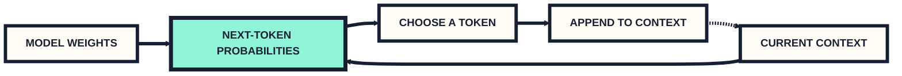
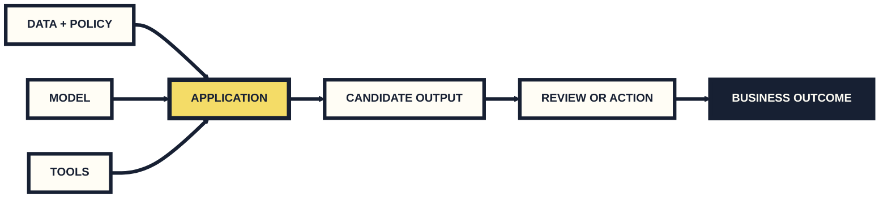
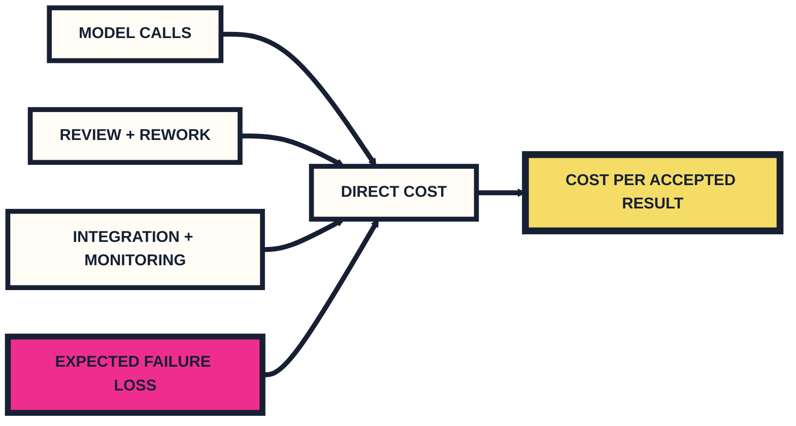

# Day 1 · Afternoon

**Continue comparing models → connect them to business work → take them to the street**

**2:00–5:00 PM · KMC 2-70 · Washington Square field mission**

<!-- slide -->

## Where we are

This morning:

- AI → machine learning → deep learning → generative AI
- output → evidence → action → consequence
- the model market: filters, modalities, context length, price per million tokens

This afternoon:

- one prompt → two models → a defensible choice (as opposed to "it's SoTA")
- business task → workflow → test → value
- field evidence → Project 1

<!-- slide -->

# One prompt, many models

The whole skill this afternoon: **give two models the identical job, read both answers, and be able to say which one you would ship and why.**

<!-- slide -->

## The language model predicts one token at a time



Truth checking is not automatically part of this loop.

<!-- slide -->

## Context

The model operates on "tokens" per turn.

- the instructions you typed;
- the instructions you did NOT type (system prompt)
- any files or images you attached;
- the earlier turns of this conversation; and
- the output it has generated so far.

**If important information is missing, stale, buried, or contradictory, the answer can fail. A large context window does not guarantee correct use.**

<!-- slide -->

## Set up the side-by-side

Go to **openrouter.ai/chat** — the page calls itself *AI Chat Playground · Compare AI Models Side by Side*.

1. Click **Add Model** (top left of the main pane).
2. **Model A — open weights.** Search for a `(free)` candidate, then check its model card and confirm that it is open weights. **Free does not mean open weights.**
3. Click **Add Model** again and add **Model B — closed.** Search in the same picker and confirm the model type on its card.
4. Both model names must be on screen before you type anything.

**No credit? Use a second `(free)` model today and record that limitation.** Project 1 still needs one confirmed open-weights and one closed model across its three runs; the instructor will provide a no-cost route.

<!-- slide -->

## Paste this into both

```text
You are drafting a reply for a campus IT help desk.

TICKET: "I have been locked out of the printing system since Monday and
I have a poster due at 5pm today. Can you reset it, and confirm I will
not be charged for the failed print jobs?"

Write the reply. State only what you can support, ask for whatever you
need, and flag anything a human must approve. Under 120 words.
```

Same prompt. Same conversation. Both models answer at once.

**Do not fix, retry, or coach it.** The first answer is the evidence.

<!-- slide -->

## Read the difference

Not “which is better.” Five specific things:

- **Format** — paragraphs, bullets, a subject line, headings you did not ask for?
- **Length** — did either respect *under 120 words*?
- **Invented specifics** — a reset time, a refund, a policy, a ticket number, a name. Underline every one.
- **Refusal and hedging** — which one declined, asked, or flagged a human? Which one just promised?
- **Cost** — not on the answer. It is on the model card at **openrouter.ai/models**: `$/M input tokens` and `$/M output tokens`.

Footer of the playground, every time: *"Responses are AI-generated and can be inaccurate. Review all outputs before relying on them."*

<!-- slide -->

## You try
Explore a few more models with this same prompt. Then, spend a few minutes and answer these 3 q's:

1. **SHIP:** which model I would send this reply from, give one piece of evidence.
2. **SWITCH IF:** what would have to be true for me to move to the other (maybe cheaper/faster) one?
3. **NEVER:** one thing neither model may do on this task, in your opinion.

<!-- slide -->

# Where are you right now?

```icerynk
{
  "version": 1,
  "kind": "poll",
  "activityId": "s2-switch-test",
  "questionId": "playground-status",
  "question": "Where are you in the two-model comparison?",
  "context": [
    "This is triage, not assessment. Choose the first point that is still blocked."
  ],
  "options": [
    { "id": "done", "label": "Two models answered the same prompt and my switch card is written" },
    { "id": "no-account", "label": "No OpenRouter account yet, or I cannot sign in" },
    { "id": "one-model", "label": "I cannot get a second model into the comparison" },
    { "id": "model-error", "label": "A model errored, was rate-limited, or asked me for credit" },
    { "id": "no-difference", "label": "Both answered, but I cannot say what actually differs" }
  ],
  "response": { "defenseRequired": false, "maxChars": 120 },
  "display": { "results": "instructor-reveal", "defenses": "instructor-only" },
  "revealLabel": "Keep the exact model names and the complete error. We group support by blocker over the break."
}
```

<!-- slide -->

# Generative AI in Business

Fun question for us:

**What work should change, and what evidence would tell us it would/should?**

<!-- slide -->

## Models can't be held accountable

It can draft a message, image, analysis, plan, interface, code change, or structured record.

Someone or something still has to:

1. provide the right context;
2. judge the output;
3. decide whether to use it; and
4. own the result.

<!-- slide -->

## Almost NO companies ship AI models. They ship a product built around one!



Model quality matters. So do context, tools, interface, review, and operating policy.

<!-- slide -->

## Start with a task, not a job title

“Replace customer service” is too broad.

“Given a damaged-delivery report and the approved policy, draft a response that states supported facts, requests missing evidence, and routes refund exceptions to a person” is testable!

**Good starting tasks have a recurring input, a defined output, a user decision, and observable success.**

<!-- slide -->

## It does not have to do the whole job


Generative AI may help with one or several steps. It does not need to own the entire workflow.

<!-- slide -->

## Just b/c it's "better", "faster" does not necessarily matter.


A better draft does not by itself establish lower cost, faster service, higher revenue, or better decisions.

<!-- slide -->

## “Looks good” is not a test

Before running the model, define:

- what must be correct;
- what evidence must appear;
- what it must never do;
- when it should say it lacks information; and
- who reviews the result.

<!-- slide -->

## Three claims, three different burdens of proof

| Level | Question | Example measure |
|---|---|---|
| **Output** | Is the candidate usable? | accuracy, support, format, hard gates |
| **Workflow** | Does the process improve? | review time, completion, exceptions |
| **Business** | Does the result matter? | cost, revenue, service, risk, adoption |

**Do not use output evidence to claim a business outcome.**

<!-- slide -->

## Compare against the current process

Every proposal needs a baseline:

- What happens now?
- How long does it take?
- Where does it fail?
- What does review cost?
- What happens when the failure is consequential?

**“Uses AI” is not a benefit.**

<!-- slide -->

## Case 1 · A support copilot improved one real workflow


**5,172 agents. Staggered rollout. 15% more issues resolved per hour.**

The largest gains went to less-experienced and lower-skilled agents. The most experienced agents saw little speed improvement and small declines on some quality measures.

Brynjolfsson, Li, and Raymond, “Generative AI at Work,” Quarterly Journal of Economics 140(2), 2025: https://doi.org/10.1093/qje/qjae044

<!-- slide -->

## Case 2 · Klarna’s first dashboard looked great


**2024:** 2.3 million conversations, work equivalent to 700 agents, resolution time cut from 11 minutes to under 2, repeat inquiries down 25%, and satisfaction reported “on par” with human agents.

**2025:** Klarna’s CEO said cost had dominated the design, quality was lower, and the company began hiring people so customers could reach human support.

**The first metrics were real. They were not the whole customer experience.**

<!-- slide -->

## Case 3 · “95% fail” is a headline, not a diagnosis


The report combined **300+ public initiatives**, **52 organizational interviews**, and **153 senior-leader survey responses**. It looked for measurable financial impact six months after a pilot.

**That can reveal a pattern. It cannot prove that 95% of all AI work is worthless.**

<!-- slide -->

## What can we actually conclude?

| Evidence | We can say | We cannot say |
|---|---|---|
| **Support rollout** | A copilot raised throughput in one live workflow; gains differed by experience. | AI raises productivity 15% everywhere. |
| **Klarna** | Early speed and volume gains coexisted with later quality concerns. | “700 agents” meant the service problem was solved. |
| **NANDA report** | Many studied organizations had no measurable financial impact after six months. | 95% of all AI work fails. |

**Before spending money, ask what was measured, against what baseline, for whom, and for how long.**

<!-- slide -->

## The cheap model can be the expensive one



A cheaper model can produce a more expensive workflow if people spend longer fixing its output.

<!-- slide -->

# NYC is the lab

Go find one small thing that is harder than it should be.

**Project 1 starts here.**

Pairs · three minutes on Friday · evidence uploaded before class

<!-- slide -->
## Project 1
- Pairs, go out and see if you can find an opportunity in the built environment to make NYC a better place
- Try different models on the same problem — OpenRouter or another playground is fine
- Details in the [assignment](https://www.icerynk.com/assignments/assignment-p1)

<!-- slide -->

## Try the task yourself

Look for a repeated task made harder because the information or capability is not good enough.

- Follow a service-change notice or check a public permit.
- Observe a repeated public task without disturbing the people doing it.
- Watch a crossing or traffic pattern from a safe public place.

**Do not start with “where could we add AI?” Start with what a person is already trying to do.**

<!-- slide -->

## Bring back an idea we can prove wrong!

Less about 'cool use of AI' and more about finding the frontier of the possible.
> Given **[input]**, produce **[output]**, so **[person]** can **[do something]**.

Then ask:

> Can we write the correct answer for one case before starting the formal runs?

If not, narrow the task.

<!-- slide -->

## Actively try things out

- Use your phones, the internet, and AI to explore.
- Treat a field AI trial as an informal experiment, not one of the three formal runs.
- Track where you stop, guess, or repeat work.
- Notice what information you need.

<!-- slide -->

## Bring back four lines

1. **What you saw**
2. **Who it makes life harder for**
3. **What they have to do about it now**
4. **What information or capability is missing** — do not say AI yet

**Then ask whether you can write the correct answer before running anything.**

<!-- slide -->

## Use your phone like a field notebook

- Take one **wide** photo for context and one **tight** photo for readable detail.
- Make notes.
- Audio or video is optional; collect it only when it is safe and permissioned.
- Record what is missing as carefully as what is present.

<!-- slide -->

## Obvious but important

- Stay with your partner in public or permitted NYU space.
- No faces, names, badges, plates, addresses, private screens, or private belongings.
- Do not record conversations without permission.
- Do not make another person the subject of the exercise.
- If anyone asks you to stop, stop and walk away.

**A hosted model is somebody else's computer. There is no unsend.**

<!-- slide -->

## The walk back is part of the 45 minutes

**Search box:** W 4th St · Broadway · W 3rd St · Sixth Ave

- **4:05 PM:** stop collecting and begin returning.
- **4:15 PM:** both partners seated in KMC 2-70, even if the packet is incomplete.
- **Indoor alternative:** NYU Library, Stern buildings, Kimmel

<!-- slide -->

## Before you turn back, write the four lines

Complete these first:

1. **What you saw**
2. **Who it makes life harder for**
3. **What they have to do about it now**
4. **What information or capability is missing**

Then draft one task sentence and one correct answer. The idea can change when you get back; it just has to be specific enough for someone else to challenge.

<!-- slide -->

## Write the smallest testable version

> Given **[input]**, produce **[output]**, so **[person]** can **[act]**.

Then finish:

- **The input comes from...**
- **We know it is correct when...**
- **If the answer is missing, the system must say...**
- **The output is checked by... before...**
- **Without AI, we would...**

**Do not start the formal runs yet. Write the test first.**

<!-- slide -->

## Talk to another pair

1. Explain the idea and the task
2. The other pair gives you:
   - one ordinary test case;
   - one case where the answer should be **“can't tell”**; and
   - one simpler non-AI fix.
3. Write down the strongest challenge. Do not defend the pitch!

<!-- slide -->

## Revise once. Build the hand-in.

- record the challenge you received;
- revise the task, answer rule, or non-AI comparison once;
- set the next time both partners will work; and
- start one shared document with the hand-in checklist:
  - the four field lines;
  - task sentence, workflow, and non-AI alternative;
  - six cases and answer key;
  - three result sets and a cost table; and
  - every raw output as text.

<!-- slide -->

# Build Log 1

Write about four things. Short and specific is enough.

1. What did you try today?
2. What surprised you or failed?
3. What will you change next?
4. How did you use AI — and where did you change or reject its output?

**Write a paragraph and submit it to Brightspace before you leave.**

<!-- slide -->

# You have the start of Project 1

Next, with your partner:
- choose OpenRouter or another playground and use one open-weights and one closed model;
- write six cases and their correct answers **before** running them;
- run a baseline, Eval A, and Eval B — one change at a time;
- make the cost trade-off table and preserve every raw output as text;
- present for three minutes at the start of class Friday — both partners speak; and
- upload one PDF or zip to Brightspace before class.

Use one slide for each presentation beat, or one page. See the [assignment](https://www.icerynk.com/assignments/assignment-p1) for the checklist.
